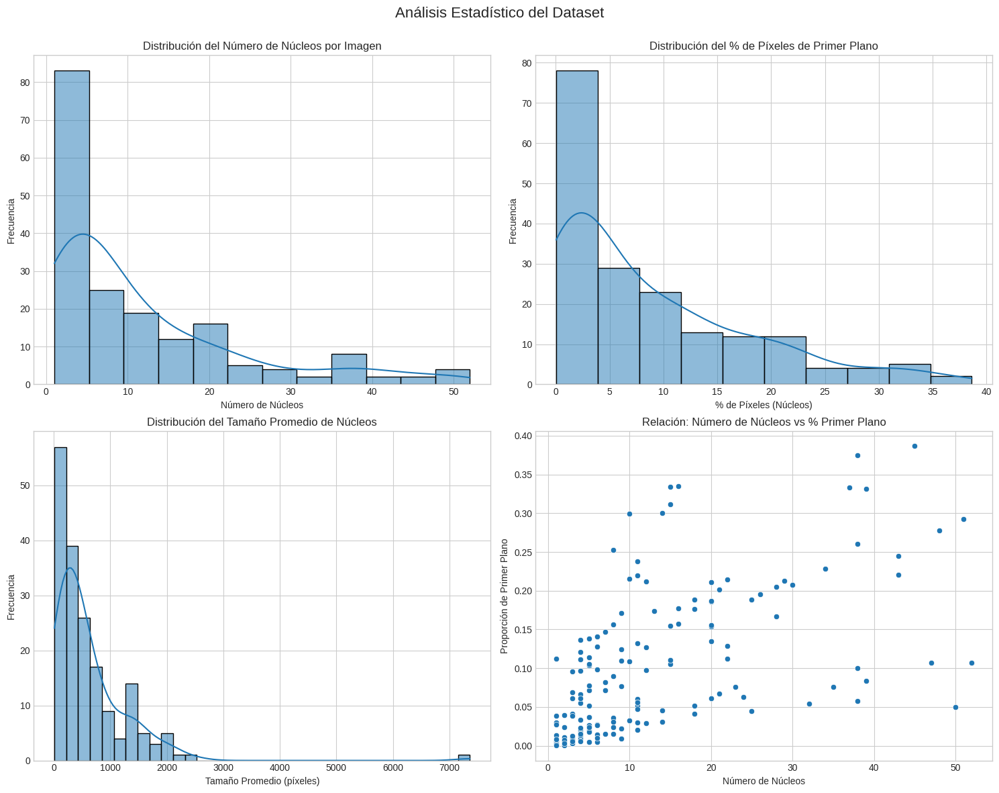

# Análisis Exploratorio del Dataset de Núcleos Celulares

## Estadísticas Descriptivas del Dataset

```
       num_nuclei  foreground_ratio  avg_nucleus_size  min_nucleus_size  \
count  182.000000        182.000000        182.000000        182.000000   
mean    11.719780          0.088379        622.319652        206.983516   
std     12.169773          0.091314        734.268391        631.658883   
min      1.000000          0.000336         11.000000          1.000000   
25%      3.000000          0.013943        188.500000         22.000000   
50%      6.500000          0.055443        376.102941         52.000000   
75%     15.750000          0.133858        793.102273        147.750000   
max     52.000000          0.386459       7364.000000       7364.000000   

       max_nucleus_size  std_nucleus_size  image_mean_intensity  \
count        182.000000        182.000000            182.000000   
mean        1280.313187        339.102316             44.097526   
std         1245.894773        384.114397             71.437425   
min           14.000000          0.000000              0.162292   
25%          316.000000         57.346071              3.705120   
50%          815.500000        195.646348             12.118019   
75%         1907.750000        501.053304             35.733524   
max         7364.000000       2063.280155            232.451645   

       image_std_intensity  
count           182.000000  
mean             18.962977  
std              17.895850  
min               1.592774  
25%               6.649023  
50%              12.602904  
75%              25.039872  
max              89.487092
```

## Metodología de Cálculo

El análisis se realizó sobre una muestra aleatoria de 182 imágenes del dataset. Para cada imagen:

1. **Cargamos la imagen y su máscara binaria** usando OpenCV
2. **Identificamos los núcleos individuales** mediante detección de componentes conectados con `ndimage.label()`
3. **Calculamos propiedades de cada núcleo** como área y estadísticas con `ndimage.sum()`
4. **Extrajimos estadísticas de intensidad** de las imágenes originales
5. **Agregamos los datos** en un DataFrame de pandas para análisis estadístico

## Análisis e Interpretación

### 1. Número de núcleos por imagen

- **Promedio**: 11.72 núcleos por imagen
- **Mediana**: 6.5 núcleos por imagen
- **Rango**: De 1 a 52 núcleos
- **Distribución**: Asimétrica hacia la derecha (muchas imágenes con pocos núcleos, pocas con muchos)

**Implicaciones**:
- El modelo debe ser igualmente eficaz con imágenes que tienen un solo núcleo o con imágenes densamente pobladas
- Las imágenes con muchos núcleos representarán desafíos para la separación de instancias

### 2. Proporción de primer plano (núcleos vs. fondo)

- **Promedio**: 8.84% de píxeles son núcleos
- **Mediana**: 5.54% de píxeles son núcleos
- **Rango**: De 0.03% a 38.65%

**Implicaciones**:
- Confirma desbalance severo: aproximadamente 91.16% de píxeles son fondo vs. 8.84% núcleos
- Relación aproximada fondo:núcleos = 10:1
- Justifica el uso de técnicas específicas para manejar desbalance:
  - Mapas de peso para bordes
  - Funciones de pérdida como Dice+BCE

### 3. Tamaño de los núcleos

- **Tamaño promedio**: 622.32 píxeles
- **Tamaño mínimo**: Desde 1 píxel
- **Tamaño máximo**: Hasta 7,364 píxeles
- **Variabilidad**: Extremadamente alta (σ=734.27)

**Implicaciones**:
- El modelo debe detectar núcleos en un rango de tamaño extremadamente amplio
- Los núcleos muy pequeños (1-20 píxeles) podrían perderse fácilmente
- Necesidad de arquitectura con capacidad multi-escala (como U-Net)
- Potencial beneficio de arquitecturas con atención para enfocarse en detalles pequeños

### 4. Variabilidad en tamaños dentro de cada imagen

- **Desviación estándar promedio**: 339.10 píxeles
- **Rango**: De 0 (imágenes con núcleos uniformes) hasta 2063.28 (gran variabilidad)

**Implicaciones**:
- Muchas imágenes contienen núcleos de tamaños muy diferentes entre sí
- El modelo debe ser sensible simultáneamente a estructuras grandes y pequeñas
- Las features maps de diferentes resoluciones serán cruciales

### 5. Intensidad de imagen

- **Promedio**: 44.10 (en escala 0-255)
- **Mediana**: 12.12
- **Desviación estándar promedio**: 18.96
- **Rango de variación**: De 1.59 a 89.49

**Implicaciones**:
- Bajo contraste general (valores de intensidad bajos)
- Alta variabilidad entre imágenes
- Necesidad de normalización efectiva
- Posible beneficio de aumentación con transformaciones de contraste

## Hallazgos Clave para el Diseño del Modelo

1. **Desbalance extremo de clases** (8.84% vs. 91.16%):
   - Justifica nuestra estrategia de mapas de peso en la Actividad 2.1
   - Requiere funciones de pérdida especializadas como combinación de Dice+BCE
   - Sugiere posible beneficio de técnicas de muestreo

2. **Amplio rango de tamaño de núcleos** (1-7,364 píxeles):
   - Arquitectura con múltiples niveles de feature maps (como U-Net)
   - Posible beneficio de características piramidales o pooling espacial adaptativo
   - Atención especial a los núcleos pequeños durante validación

3. **Variación significativa de intensidad y contraste**:
   - Implementar normalización robusta
   - Considerar aumentación de datos con transformaciones de brillo/contraste
   - Posible beneficio de normalización por lotes durante el entrenamiento

4. **Densidad variable** (1-52 núcleos por imagen):
   - Mayor densidad = mayor probabilidad de núcleos que se tocan
   - Refuerza la importancia de precisión en bordes
   - Sugiere necesidad de post-procesamiento basado en watershed para separar núcleos adyacentes



## Recomendaciones para Siguiente Fase

Basándonos en este análisis exploratorio, las siguientes técnicas serán particularmente importantes:

1. **Mapas de peso específicos para bordes** (Actividad 2.1):
   - Dar mayor peso a píxeles de borde entre núcleos que se tocan
   - Contrarrestar el desbalance dando menor peso al fondo

2. **Arquitectura U-Net con skip connections robustas**:
   - Preservar información espacial para bordes precisos
   - Considerar Attention U-Net para mejor foco en detalles pequeños

3. **Estrategia de pérdida híbrida**:
   - Combinar Dice (insensible a desbalance) y BCE (con pesos)
   - Posible término adicional para precisión en bordes

4. **Pipeline de post-procesamiento**:
   - Transformada de distancia + watershed para separación de instancias
   - Filtrado de componentes pequeños para reducir falsos positivos

Este análisis exploratorio proporciona una base sólida para comprender los desafíos específicos del dataset y diseñar soluciones apropiadas en las próximas etapas del proyecto.


