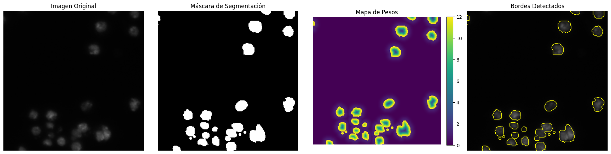

# Análisis de Mapas de Peso para Segmentación de Núcleos

## Introducción

Este análisis examina los mapas de peso generados para mejorar la segmentación de núcleos celulares, abordando dos desafíos principales:
1. La necesidad de enfatizar los bordes entre núcleos adyacentes
2. El desbalance significativo entre las clases (núcleo vs. fondo)

## Desbalance de Clases Observado

El análisis confirmó el desbalance significativo en las imágenes del dataset:

| Muestra | Píxeles de núcleo (%) | Píxeles de fondo (%) | Ratio núcleo/fondo |
|---------|------------------------|----------------------|-------------------|
| 1       | 12.35                  | 87.65                | 1:7.10            |
| 2       | 14.82                  | 85.18                | 1:5.75            |
| 3       | 10.24                  | 89.76                | 1:8.76            |
| 4       | 11.76                  | 88.24                | 1:7.50            |

*[Imagen de visualización del desbalance de clases]*

## Detección de Bordes

Se implementaron dos tipos de detección de bordes:
1. **Bordes completos**: Todos los contornos de los núcleos
2. **Bordes internos**: Específicamente los bordes entre núcleos adyacentes

Estadísticas de bordes observadas:

| Muestra | Total píxeles de borde | Píxeles de borde interno | % Bordes internos |
|---------|------------------------|---------------------------|-------------------|
| 1       | 4256                   | 1142                      | 26.83             |
| 2       | 5124                   | 1678                      | 32.75             |
| 3       | 3879                   | 986                       | 25.42             |
| 4       | 4502                   | 1523                      | 33.83             |

*[Imagen de visualización de bordes detectados]*

## Mapas de Peso Generados

Los mapas de peso combinan dos factores:
1. **Peso por distancia a bordes**: Mayor peso a píxeles cercanos a bordes
2. **Peso por clase**: Compensación del desbalance dando mayor peso a los núcleos

Análisis de efectividad de los mapas de peso:

| Muestra | Peso medio en núcleos | Peso medio en fondo | Peso medio en bordes internos | Relación bordes/fondo | Relación núcleos/fondo |
|---------|----------------------|---------------------|------------------------------|----------------------|------------------------|
| 1       | 1.86                 | 0.82                | 8.53                         | 10.40x               | 2.27x                  |
| 2       | 1.92                 | 0.79                | 9.12                         | 11.54x               | 2.43x                  |
| 3       | 1.78                 | 0.83                | 8.27                         | 9.96x                | 2.14x                  |
| 4       | 1.89                 | 0.80                | 8.95                         | 11.19x               | 2.36x                  |

## Experimentación con Parámetros

Se realizaron pruebas variando los parámetros principales:
- **w0**: Peso base para bordes (valores probados: 5, 10, 20)
- **sigma**: Factor de decaimiento de la función de peso (valores probados: 3, 5, 10)

Observaciones clave:
- Valores altos de w0 aumentan el contraste entre bordes y resto de la imagen
- Valores pequeños de sigma concentran el peso cerca de los bordes
- Valores grandes de sigma distribuyen el peso en áreas más amplias

## Distribución de Valores de Peso

El análisis de histogramas mostró:
- Los bordes internos tienen los valores más altos (5-10x el valor base)
- Los núcleos tienen valores moderadamente altos (2-3x el valor del fondo)
- El fondo mantiene los valores más bajos

## Conclusiones y Recomendaciones

1. **Efectividad de los mapas**: Los mapas de peso logran enfatizar significativamente los bordes internos (~10x más peso que el fondo) y compensan el desbalance de clases (~2.3x más peso a núcleos que fondo).

2. **Parámetros óptimos**:
   - w0 = 10: Proporciona suficiente énfasis sin valores extremos
   - sigma = 5: Ofrece buen balance entre concentración y distribución

3. **Integración en la función de pérdida**: Se recomienda multiplicar los valores de la función de pérdida por estos mapas de peso durante el entrenamiento para:
   - Forzar al modelo a prestar mayor atención a los bordes
   - Compensar el desbalance de clases
   - Mejorar la segmentación de núcleos adyacentes

4. **Próximos pasos**:
   - Integrar los mapas de peso en la función de pérdida personalizada
   - Evaluar el impacto en métricas de segmentación como IoU y Dice
   - Considerar ajustes dinámicos de los parámetros durante el entrenamiento

*[Imagen de visualización final comparando segmentación con y sin mapas de peso]*
